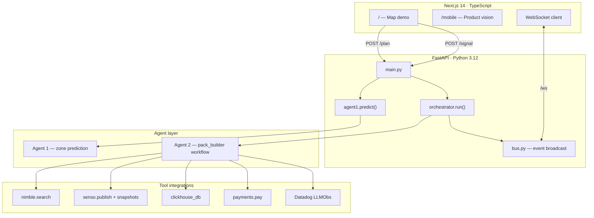
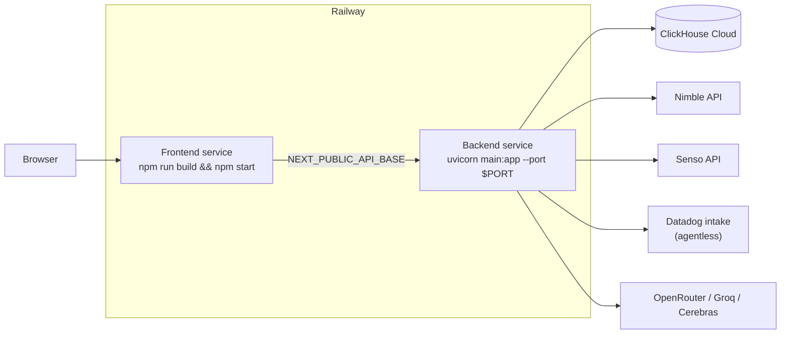

<div align="center">

# DeadZone

### Your signal dies in four minutes. Your agent already has the pack.

[](LICENSE)
[](backend/requirements.txt)
[](frontend/package.json)
[](backend/requirements.txt)
[](backend/tools/datadog.py)
[](backend/railway.toml)

**Built at the [Datadog NYC Agentic Engineering Hackathon](https://www.datadoghq.com/) · May 2026**

[Live Demo](https://deadzone-production-df6d.up.railway.app) · [Mobile Vision](https://deadzone-production-df6d.up.railway.app/mobile) · [Quick Start](#quick-start)

</div>

---

## One-liner

**DeadZone is an autonomous continuity agent that detects upcoming cellular dead zones, builds a cited offline content pack before you lose signal, caches it for the next traveler, and settles micropayments between agents when a pack is reused.**

---

## The problem

You are on the Million Dollar Highway, the L train under the East River, or BART through the Transbay Tube. The bars drop. Weather, road conditions, transit alerts, directions, and emergency contacts vanish with them. You only notice once it is too late.

Dead zones are predictable. Losing context inside them is not inevitable.

---

## Why DeadZone exists

Connectivity gaps are geographic and repeatable. The same tunnel, pass, and desert corridor goes dark for every traveler who follows you. Today each person hits that gap alone and rebuilds the same research from scratch.

DeadZone treats a dead zone as a **marketplace for pre-built continuity**:

1. **Agent 1** predicts where signal will drop along your route.
2. **Agent 2 (pack builder)** researches, publishes, and caches a cited pack while you still have bars.
3. **The next rider** buys that pack in about a second instead of waiting for a full rebuild.

The product ships as a **deployed web application** on Railway with a live map demo, real LLM orchestration, sponsor API integrations, and Datadog LLM Observability traces for every run.

---

## Product overview

| Stage | What happens | What you see |
|-------|----------------|--------------|
| **Plan** | `POST /plan` runs route dead-zone prediction | Zones plotted on the map |
| **Approach** | Dot nears a zone; `POST /signal` fires ~4 min before entry | Alert card: signal drops soon |
| **Build** | Orchestrator searches, publishes, caches, delivers | Preparing card + live agent log waterfall |
| **Ready** | Pack URL delivered over WebSocket | Open Continuity Pack |
| **Reuse** | Second user hits same zone; cache hit + micropayment | Instant delivery card |
| **Offline** | UI simulates no-signal window inside the zone | Overlay + `tel:` links still work for voice |
| **Replay** | Full trace stored per run | Re-stream agent log at original timing |

> **Drivers and transit riders.** Trip planner tabs cover six iconic driving corridors and three real transit lines (NYC E/L, BART). Route type drives search strategy, pack headings, and curated emergency content.

---

## Architecture



### Repository layout

```
deadzone-updated/
├── backend/                    # Production API (uvicorn main:app)
│   ├── main.py                 # /signal, /plan, /ws, /dashboard, /trace/*
│   ├── bus.py                  # WebSocket broadcast bus
│   ├── seed.py                 # Demo dashboard seed data
│   ├── schema.sql              # ClickHouse DDL
│   └── tools/
│       ├── orchestrator.py     # LLM tool loop, scripted fallback, quality eval
│       ├── agent1.py           # Dead-zone prediction + normalization
│       ├── nimble.py           # Nimble SERP + curated zone stubs
│       ├── senso.py            # Senso publish + inline page snapshots
│       ├── clickhouse_db.py    # Packs, events, payments, traces
│       ├── payments.py         # Simulated agent-to-agent settlement
│       ├── llm_circuit.py      # Per-provider circuit breakers
│       └── datadog.py          # LLMObs agentless init
├── frontend/                   # Next.js App Router
│   ├── app/page.tsx            # Main demo
│   ├── app/mobile/page.tsx     # Six-feature product landing
│   ├── lib/route.ts            # Polylines, haversine, zone geometry
│   └── components/             # Map, TripPlanner, LiveLogs, overlays…
└── (legacy root scripts)       # server.py, agent2_curation.py — not the live path
```

---

## How the agent system works

### Two agents, one product loop

| Agent | Code | Responsibility |
|-------|------|----------------|
| **Agent 1** | `backend/tools/agent1.py` → `predict()` | Dead-zone prediction along a route. Chain: LLM → CoverageMap/Google (if keys set) → hardcoded transit/driving zones → generic stub. |
| **Agent 2** | `backend/tools/orchestrator.py` → `run()` | Pack builder. OpenAI-style function calling with seven tools, or deterministic scripted mode. |

### Orchestrator flow

```
POST /signal
    → orchestrator.run()          [@workflow deadzone_signal]
        → mode: agentic | auto | scripted
        → _run_with_llm()         [@agent pack_builder]
              iter 0: LLM plans (cache_find + parallel nimble_search)
              forced steps: senso_publish → clickhouse_save_pack → deliver_pack
        → on LLM failure: _finalize_from_messages() preserves iter-0 work
        → _eval_pack()            async quality score
    → WebSocket: tool_start / tool_end / pack_ready / payment / eval_complete
```

The orchestrator is **not a hardcoded pipeline**. In `agentic` mode the LLM receives seven tool schemas and decides queries and pack structure. The server **forces tool sequence** when prerequisites are met so free-tier models cannot stop before `deliver_pack`:

| State | Forced tool |
|-------|-------------|
| Has searches, no `pack_url` | `senso_publish` |
| Has `pack_url`, no `pack_id` | `clickhouse_save_pack` |
| Has `pack_id`, not delivered | `deliver_pack` |

### Tools exposed to the LLM

| Tool | Implementation | Purpose |
|------|------------------|---------|
| `clickhouse_find_recent_pack` | `db.find_recent_pack` | Cache lookup (always first) |
| `nimble_search` | `nimble.search` | Web search per topic |
| `senso_publish` | `senso.publish` | Cited pack to public URL |
| `clickhouse_save_pack` | `db.save_pack` | Persist for future buyers |
| `payments_pay` | `payments.pay` | Agent-to-agent settlement on cache hit |
| `clickhouse_log_event` | `db.log_event` | Telemetry |
| `deliver_pack` | emits `pack_ready` | Notify frontend |

### Route-type-aware content

The system prompt classifies routes so Nimble queries match context (`orchestrator.py`):

| Type | Examples | Search focus |
|------|----------|--------------|
| **Transit** | E train, L train, BART | Service alerts, delays, commuter news |
| **Mountain** | US-550, Big Sur, Vail | Elevation weather, closures, SAR contacts |
| **Rural** | US-50 Nevada | Long-horizon forecast, fuel, NDOT conditions |
| **Tunnel** | Lincoln Tunnel | Weather + road + POI scaled to duration |
| **Default** | Other highways | Standard four-topic search |

### LLM resilience

Three-provider chain with **independent per-provider circuit breakers** (`llm_circuit.py`):

1. **OpenRouter** (primary) — default `google/gemini-2.0-flash-001`
2. **Groq** — `llama-3.3-70b-versatile` (planning), `llama-3.1-8b-instant` (focused steps)
3. **Cerebras** — final fallback

Terminal failures (402, 401, billing) trip for `LLM_CIRCUIT_TERMINAL_COOLDOWN_SEC` (default 1h). Transient failures (429, 5xx, timeout) trip for `LLM_CIRCUIT_COOLDOWN_SEC` (default 60s). Mid-flow LLM failure triggers `_finalize_from_messages()` so search results from iter 0 are not discarded.

### Pack quality score

After delivery, `_eval_pack()` emits `eval_complete`:

```
score = coverage(40%) + SLA pass(40%) + completion(20%) − error penalty (5 pts/error, max 30)
```

SLA pass means build completed in under 85% of `eta_seconds`. The Ready card shows green (≥80), amber (≥60), or red.

### Agent-to-agent payments

On cache hit, the orchestrator calls `payments_pay` from `user_b` to `user_a` for **$0.02** (`PRICE_USD` in `orchestrator.py`). Settlement is **simulated** (fake `tx_id`, no on-chain dependency), modeled on x402-style agent micropayments.

<details>
<summary><strong>Datadog LLM Observability trace shape</strong></summary>

Every run appears as a single trace when `DD_API_KEY` is set:

```
workflow: deadzone_signal
  agent: pack_builder
    llm: openai.chat.completions.create   (auto-instrumented)
    tool: clickhouse_find_recent_pack
    tool: nimble_search × N               (often parallel)
    tool: senso_publish
    tool: clickhouse_save_pack
    tool: payments_pay                    (cache-hit path)
    tool: deliver_pack
```

- `LLMObs.enable(agentless_enabled=True)` in `datadog.py` — no Datadog Agent process
- `@workflow`, `@agent`, `@tool` decorators; decorators no-op without API key
- **Application:** `deadzone-agent` (configurable via `DD_LLMOBS_ML_APP`)

</details>

---

## Key features

| Feature | Status | Notes |
|---------|--------|-------|
| LLM function-calling orchestrator | ✅ Real | OpenRouter → Groq → Cerebras with circuit breakers |
| Live agent log waterfall | ✅ Real | `tool_start` / `tool_end` with ms timing over `/ws` |
| Web search | ✅ Real | Nimble SERP; falls back to LLM + zone-aware curated stubs |
| Cited pack publishing | ✅ Real | Senso cited.md; local `/static/packs/` fallback |
| Inline cached page snapshots | ✅ Real | httpx + BeautifulSoup; WAF/paywall rejection (~50 patterns) |
| Curated offline summaries | ✅ Real | Mile markers, `tel:` links, tunnel radio, SAR contacts |
| Pack cache + dashboard | ✅ Real | ClickHouse Cloud or in-memory fallback |
| Trace replay | ✅ Real | Client replays via `GET /trace/{id}` |
| Datadog LLM Observability | ✅ Real | Agentless `ddtrace`; silent no-op without key |
| Agent-to-agent payment | ⚡ Simulated | $0.02, fake tx hash |
| Offline “no signal” UI | ⚡ Simulated | ~30% of zone duration overlay |
| Native iOS / Android | 📱 Vision only | `/mobile` product landing |

### Three-layer pack model

1. **Curated summary** — Dense plain-text with actionable offline content (`_ZONE_SOURCES` in `nimble.py` / `senso.py`).
2. **Cached snapshots** — Source URLs fetched at publish time; accordion “Read cached page” in pack HTML.
3. **Strict rendering** — Sources shown only if reachability check passed **and** snapshot extracted cleanly (≥500 chars, no bot-block phrases).

### Demo routes (9)

**Driving (6)**

| Route | Highlight |
|-------|-----------|
| Manhattan → Newark | Lincoln Tunnel |
| Denver → Vail | Eisenhower Tunnel, Vail Pass |
| Los Angeles → Las Vegas | Cajon Pass, Mojave Desert |
| Big Sur, PCH | Highway 1, Bixby Bridge |
| US-50 Nevada | The Loneliest Road |
| Million Dollar Highway | Ouray → Durango, Red Mountain Pass |

**Transit (3)**

| Route | Highlight |
|-------|-----------|
| E: Jamaica → WTC | NYC Subway |
| L: Canarsie → 8th Ave | Canarsie Tunnel / East River |
| BART: Embarcadero → SFO | Transbay Tube |

---

## Screenshots

> Add assets to `/docs/screenshots/` and replace placeholders below.

| | |
|:---:|:---:|
| **Trip planner & map** | **Agent log waterfall** |
| `[screenshot-trip-planner.png]` | `[screenshot-agent-log.png]` |
| *Route selector, dead zones on map* | *Live tool_start / tool_end timing* |
| **Ready card & pack** | **Cache-hit instant delivery** |
| `[screenshot-pack-ready.png]` | `[screenshot-cache-hit.png]` |
| *Open Continuity Pack inline* | *Rider reuses Driver's pack* |
| **Datadog LLM Observability** | **Mobile vision (`/mobile`)** |
| `[screenshot-datadog-trace.png]` | `[screenshot-mobile-vision.png]` |
| *`deadzone-agent` workflow trace* | *Six scroll-snapped feature panels* |

---

## Technology stack

| Layer | Technology |
|-------|------------|
| **Frontend** | Next.js 14 (App Router), React 18, TypeScript, Tailwind CSS 3, react-leaflet |
| **Backend** | Python 3.12, FastAPI, uvicorn, httpx, WebSockets, Pydantic |
| **Agents** | OpenAI SDK function calling, multi-provider fallback, per-provider circuit breakers |
| **Search** | [Nimble](https://nimbleway.com/) SERP API |
| **Publish** | [Senso](https://senso.ai/) cited.md |
| **Storage** | ClickHouse Cloud (`schema.sql`) + in-memory fallback |
| **Observability** | [Datadog LLM Observability](https://docs.datadoghq.com/llm_observability/) (`ddtrace`, agentless) |
| **Extraction** | BeautifulSoup4, tag whitelist, bot-block / paywall phrase rejection |
| **Hosting** | Railway (Nixpacks) |

---

## Deployment architecture



| Service | Config | Start command |
|---------|--------|---------------|
| **Backend** | `backend/railway.toml` | `uvicorn main:app --host 0.0.0.0 --port $PORT` |
| **Frontend** | `frontend/railway.toml` | `npm install && npm run build` → `npm start` |

Production CORS allows `https://deadzone-production-df6d.up.railway.app` (`backend/main.py`). Set `PUBLIC_BASE_URL` to your backend Railway URL so fallback pack links resolve correctly.

<details>
<summary><strong>Environment variables</strong></summary>

| Variable | Required | Fallback |
|----------|----------|----------|
| `OPENROUTER_API_KEY` | No | Groq → Cerebras → scripted |
| `OPENAI_MODEL` | No | `google/gemini-2.0-flash-001` |
| `GROQ_API_KEY` / `GROQ_MODEL` / `GROQ_MODEL_SMALL` | No | Provider chain |
| `CEREBRAS_API_KEY` / `CEREBRAS_MODEL` | No | Provider chain |
| `NIMBLE_API_KEY` | No | LLM stub → curated zone stubs |
| `SENSO_API_KEY` | No | Local `/static/packs/` |
| `CLICKHOUSE_HOST` / `USER` / `PASSWORD` | No | In-memory dict |
| `DD_API_KEY` / `DD_SITE` / `DD_LLMOBS_ML_APP` | No | Observability no-op |
| `PUBLIC_BASE_URL` | No | `http://localhost:8000` |
| `ORCHESTRATOR_MODE` | No | `agentic` (`agentic` / `auto` / `scripted`) |
| `LLM_TIMEOUT_SEC` | No | `5` |
| `LLM_CIRCUIT_COOLDOWN_SEC` | No | `60` |
| `LLM_CIRCUIT_TERMINAL_COOLDOWN_SEC` | No | `3600` |
| `PACK_SNAPSHOT_TIMEOUT_SEC` | No | `6` |
| `PACK_SNAPSHOT_MAX_CHARS` | No | `6000` |
| `NEXT_PUBLIC_API_BASE` | No | `http://localhost:8000` |

**Zero keys required.** The full demo flow runs end-to-end with an empty `.env` thanks to stubs and scripted fallback.

</details>

---

## Example workflow

### 1 · Plan a trip

Open the app → **Trip Planner** → Driving or Transit tab → pick a route → **Plan Trip**.

`POST /plan` → Agent 1 returns zones → map draws circles → `zones_ready` on WebSocket.

### 2 · Driver builds a pack

**Start Trip** as **Driver** (`user_a`). When the dot enters a dead-zone radius:

```
POST /signal
  → cache miss
  → 4× nimble_search (parallel)
  → senso_publish (with inline snapshots)
  → clickhouse_save_pack
  → deliver_pack
```

Banner: Alert → Preparing → Ready. Agent log streams every tool call.

### 3 · Rider buys the cache

Switch to **Rider** (`user_b`), same route. On the same zone:

```
POST /signal
  → clickhouse_find_recent_pack (hit)
  → payments_pay ($0.02)
  → deliver_pack (~1s)
```

Banner shows instant delivery. Dashboard increments trips covered and total paid.

### 4 · Read offline

**Open Continuity Pack** → sections with curated summaries, `tel:` links, cited sources with cached accordions. Blocked sources are hidden entirely.

### 5 · Replay

After a run, **Replay** re-streams the stored trace at original timing (`GET /trace/{trace_id}`).

---

## Quick start

```bash
# Backend
cd backend
cp .env.example .env   # optional — everything has fallbacks
pip install -r requirements.txt
uvicorn main:app --reload --port 8000

# Frontend (new terminal)
cd frontend
npm install
npm run dev

# → http://localhost:3000
```

<details>
<summary><strong>API reference</strong></summary>

| Method | Path | Description |
|--------|------|-------------|
| `POST` | `/signal` | User approaching dead zone; spawns orchestrator |
| `POST` | `/plan` | Predict zones for route |
| `POST` | `/run_pipeline` | Predict all zones + orchestrate each |
| `GET` | `/dashboard` | Aggregate stats |
| `GET` | `/traces` | List trace IDs |
| `GET` | `/trace/{trace_id}` | Events for replay UI |
| `GET` | `/replay/{trace_id}` | SSE replay at original timing |
| `GET` | `/llm-check` | Provider health + circuit state |
| `GET` | `/llm-models` | Models exposed per provider key |
| `POST` | `/llm-circuit/reset` | Close all breakers |
| `WS` | `/ws` | Real-time agent events |

</details>

---

## Future roadmap

| Priority | Initiative |
|----------|------------|
| **P0** | Native iOS / Android apps (GPS auto-detect, CarPlay, lock-screen countdown) |
| **P0** | Real agent-to-agent settlement (x402 or similar) replacing simulated `payments.pay` |
| **P1** | Production auth, rate limits, and multi-tenant pack ownership |
| **P1** | Wire `AGENT1_URL` or retire stub; optional CoverageMap + Google Maps enrichment |
| **P2** | Push notifications and contact alerts before dead zones |
| **P2** | Docker images and CI pipeline |
| **P3** | Automatic route detection without manual trip planner selection |

The `/mobile` page already prototypes six product pillars: GPS detection, countdown surfaces, contact alerts, traffic reroute, staged pre-fetch, and seamless return sync.

---

## Lessons learned

### Product & UX

An **18-reviewer study** (9 routes × 2 personas: desktop driver, mobile transit rider) drove major changes:

- **Transit was invisible** in early copy and mockups. Every surface now speaks to drivers *and* riders; BART and subway examples ship in `/mobile`.
- **Jargon kills trust.** User-facing strings say “Signal Guard” and “continuity pack,” not sponsor codenames or “x402 pay.”
- **Scale matters in copy.** A 20-minute subway tunnel and an 80-minute Nevada gap need different staging expectations.
- **Mountain routes need safety-first content.** SAR numbers, sheriff contacts, CDOT/CAIC advisories, and elevation weather are non-negotiable for US-550 and PCH.

### Engineering

- **Force tool sequence, let the LLM own content.** Free-tier models stop early; `tool_choice` guarantees publish → save → deliver while preserving query and summary creativity.
- **Split model sizes by step.** Planning on 70B, focused steps on 8B, keeps Groq free-tier TPM under control.
- **Mid-flow finalizer beats cold restart.** `_finalize_from_messages()` reuses iter-0 searches when the LLM provider fails mid-pipeline.
- **Offline means offline.** Curated text is the product; links are supplementary. Hide any source that cannot be fully cached.
- **Memoize map layers.** Static route polylines and zone circles must not re-render on every position tick (~3 Hz).
- **Observability is a sponsor deliverable.** Agentless Datadog LLMObs makes every tool call and LLM hop visible without running a sidecar agent.

---

## My contributions

This repository is my maintained fork of DeadZone. I own the product direction, user-facing experience, and how the project is presented end to end. My work sits at the intersection of product strategy, UX, technical collaboration, and shipping, not documentation alone.

### Product strategy & problem framing

- Defined the core user problem: predictable connectivity loss should not mean unpredictable loss of context.
- Framed DeadZone as a continuity product (detect → prepare → deliver → reuse), not a generic “AI demo.”
- Identified the real pain point behind dead zones: travelers lose weather, transit alerts, road conditions, and emergency information at the moment they need it most.
- Asked product, technical, and operational questions that shaped what we built, what we deferred, and what had to work in a live demo.
- Contributed to feature prioritization and roadmap thinking (driver vs rider flows, cache reuse, offline-readable packs, mobile vision).

### User experience & interaction design

- Designed the end-to-end journey: plan trip → approach zone → build or buy pack → read offline → return online → replay.
- Mapped user behavior **before, during, and after** entering a dead zone (countdown, alert/preparing/ready states, offline overlay, post-reconnect feedback).
- Shaped UX/UI flow and information hierarchy: what surfaces when (banner cards, agent log, dashboard strip, pack modal).
- Determined what information users need in each phase and in what format (actionable summaries first, cited sources second, hidden when not offline-safe).
- Drove inclusivity for **drivers and transit riders** in copy, route examples, and `/mobile` mockups.
- Participated in structured usability feedback (18-reviewer study across routes and personas) and translated findings into concrete UX fixes.
- Tested assumptions from a workflow and adoption lens, not only a technical one.

### Systems thinking & agent experience

- Defined how users should understand autonomous behavior without jargon (live agent log, timing waterfall, replay).
- Collaborated on how Agent 1 (prediction) and Agent 2 (pack builder) should feel as a single product loop.
- Helped specify cache-hit vs build paths, instant delivery messaging, and payment/settlement storytelling for demos.
- Bridged engineering capabilities (tool calls, cache, publish, deliver) with understandable user-facing states.

### Technical collaboration & implementation support

- Collaborated on technical decisions where product requirements met system constraints (orchestrator modes, fallbacks, route-type content strategies).
- Identified edge cases and real-world scenarios (mountain safety content, tunnel vs desert staging, unreachable sources, empty log states).
- Brainstormed and proposed product enhancements aligned with sponsor integrations and hackathon scope.
- Supported testing and validation of flows across local and deployed environments.

### Repository modernization, deployment & presentation

- Led repository modernization and clearer separation of the live demo path (`backend/` + `frontend/`) from legacy scripts.
- Supported Railway deployment and production-readiness efforts (frontend/backend services, environment configuration, demo reliability).
- Authored agent-system and architecture documentation so engineers can trace `/signal` → orchestrator → tools → WebSocket events.
- Redesigned this README for portfolio and production presentation: problem narrative, architecture diagrams, honest feature matrix, deployment guide.
- Translated a hackathon agent stack into a coherent, recruiter- and engineer-friendly product story.

### How I work on this project

| Lens | Focus |
|------|--------|
| **Product strategy** | Problem definition, positioning, prioritization |
| **User experience design** | Journeys, IA, overlays, copy, accessibility of agent behavior |
| **Technical collaboration** | Requirements for agents, packs, cache, and observability |
| **Deployment support** | Railway, env fallbacks, live demo stability |
| **Cross-functional problem solving** | Connecting user needs, demo constraints, and implementation tradeoffs |

I did not single-handedly implement the full backend agent stack; I partnered on engineering while owning product framing, UX direction, documentation quality, and how DeadZone is experienced and explained.

---

## License

This project is licensed under the [MIT License](LICENSE). See `LICENSE` for copyright and terms.

---

<div align="center">

**DeadZone** · Agentic Engineering Hack · Datadog NYC · May 2026

*Connectivity gaps are predictable. Losing context inside them is not.*

</div>
